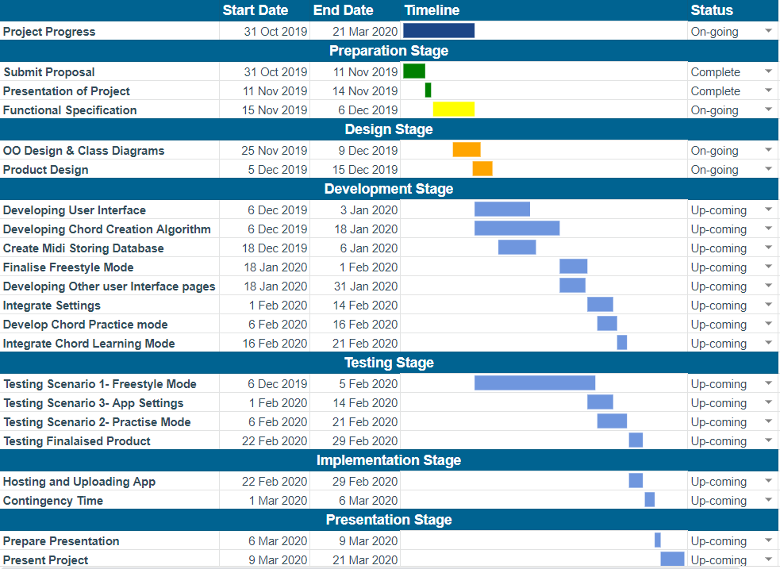

# **Functional Spec**

## 0. Table of contents

- Introduction……………………………………………………………………………...…3
  - 1 Overview
  - 2 Business Context
  - 3 Glossary
- General Description……………………………………………………………...…………………….4
  - 1 Product / System Functions
  - 2 User Characteristics and Objectives
  - 3 Operational Scenarios
  - 4 Constraints
- Wireframes………………………………………………………………………………...7
  - 1 Home Page Wireframe
  - 2 Freestyle Mode Wireframe
  - 3 Chord learning mode Wireframe
- Functional Requirements………………………………………………………………...9
  - 1 Displaying Strings And Frets On The Screen
  - 2 Playing Notes The User Selects
  - 3 Creating Chords From Notes
  - 4 Strumming Feature
  - 5 Providing Ability To Select Chords To Practice
  - 6 Providing User Feedback
- System Architecture………………………………………………………………………………....12
  - 1 Application User Interface
  - 2 Java Framework
  - 3 Internal Storage
- High-Level Design………………………………………………………………………14
  - 1 Context Diagram
  - 2 Data Flow Diagrams
  - 3 Object Models and Class Diagrams
- Preliminary Schedule………………………………………………………………….20
- Appendices……………………………………………………………………………..21
  - 1 Further explanation on how chords and notes work
  - 2 Information on Technical Specifications
  - 3 UML Class Diagram - Fret and Coordinates

## 1. Introduction

### 1.1 Overview

Our project is called &quot;String Theory&quot;. String Theory is an android app to help users learn and practice guitar chords without a guitar. This is especially useful for those who travel a lot, use public transport, or for beginners who can&#39;t practise on a real guitar for long periods of time without their fingers hurting.

The idea is that the phone&#39;s screen would be transformed to look like a guitar&#39;s fretboard. When the user makes a strumming motion near the base of the phone&#39;s screen, notes will be played that will correspond to where the user&#39;s fingers are placed. If a user presses down more than one note at once, the app will combine them to play a chord.

Since the app is aimed at beginners learning the guitar, we will have a &quot;chord learning mode&quot; where users can practice playing popular chords and get feedback in real-time. In this mode  if your fingers are all in the right spots for the chord being practised, the app will give you feedback by making the phone vibrate.

Our main focus is for the app to develop the &quot;freestyle mode&quot;, where users are free to play what they want, and our secondary goal is to build in the chord learning mode.

### 1.2 Business Context

Not applicable to our project since we aren&#39;t working with a business and we don&#39;t intend to put ads on/charge for our app.

### 1.3 Glossary

Fretboard - Also called the neck or fingerboard of a guitar. A long thin wooden part of a guitar divided up by frets where the player pushes the strings to make notes.

Midi files - Musical Instrument Digital Interface – A language that represents sound files. Designed to standardize communication between computers and electronic musical instruments.

Multi-touch - A technology allowing a touchscreen to detect and track 2 or more points of contact (usually the user&#39;s fingers) at once.

Chord- a group of (typically three or more) notes sounded together to make a new sound

Fretting - when a guitar player pushes on a string over a particular fret to select a note, also called fingering.

## 2. General Description

### 2.1 Product / System Functions

The user will download our app from the Android Play Store onto their phone. The app will essentially turn the phone&#39;s screen into a fretboard, divided into 4-5 frets (depending on phone size) with the 6 strings displayed on it. The user will hold the phone like the neck of a guitar and as they push down on the virtual strings the note associated with the string in that position will be played.

The main feature of our app is the freestyle mode. The user simply opens the app and selects this mode. Here, the user can place their fingers anywhere on the strings and combine whichever notes they like in order to build up their own chords. The user then strums the base of the phone&#39;s screen, which represents the sound hole of a guitar. When the user strums, the chord made from the notes they have selected will be played.

The secondary feature will be the chord learning mode. This mode will show the user the correct positions to place their fingers for the selected chord. When all the fingers are in the correct position, the user strums the base of the phone to play the chord. If the user has played the chord correctly the chord being played from the speakers will sound correct. If the user played the chord incorrectly the chord that is being played will sound wrong and they user will also get feedback from the phone vibrating. The string that the user has &quot;fretted&quot; incorrectly will be highlighted on the screen to help them more.

Using our app, the user will develop an association between the sound of a chord their muscle memory by practicing chords.

### 2.2 User Characteristics and Objectives

We are creating this app for guitarists. It will be important to make sure that using the app replicates the experience of playing the guitar as closely as possible so practising with String Theory translates to improved guitar skills. Ensuring that the fretboard appears on screen as roughly the correct width is important. Making sure that the app produces the correct sounds in response to where your fingers are placed is also a requirement because developing a connection between sound and where your fingers are is fundamental to playing any instrument.

Our idea specifically has newer guitarists in mind, those who are still learning the instrument. Once we have the main functionality of our app down we would like to add a learning mode for these users. This mode would teach the standard chords beginners learn when they first pick up the guitar. It would be important for this mode to give feedback to the users when they get a chord correct (for example, the phone vibrates).

The users we have in mind will be familiar with the android environment and should be able to download and install the app. While most of our users will have some prior experience with using android apps but they won&#39;t need to be particularly &quot;good&quot; with technology to use String Theory. To make sure our app is as accessible to as many users as possible we will follow good user interface guidelines. A requirement is that our app is intuitive to use and consistent with other apps.

### 2.3 Operational Scenarios

#### Operational Scenario 1 - Freestyle mode

1. The user opens the app on their android device.
2. The user is greeted by the main menu.
3. The user selects the freestyle mode.
4. The user sees the neck of a guitar, including the first 4-5 frets and 6 strings being displayed by the app.
5. The user presses their fingers onto various fret/string combinations to select nodes and chords (as they would if they were playing a real guitar).
6. The user moves their finger along the base of the phone&#39;s screen in a strumming fashion to play the notes and chords they have selected.
7. The user can continue to use the guitars freestyle mode, return to the main menu of the app, or close down the app.

#### Operational Scenario 2 - Chord learning mode

1. The user opens the app on their android device.
2. The user is greeted by the main menu.
3. The user selects the learn chords mode.
4. The user selects the chord that they want to practice from a list.
5. The user sees the neck of the guitar with the first 5 frets and 6 strings being displayed by the app.
6. The fret/string combinations associated with the selected chord to be practiced are highlighted.
7. The correct finger positions on the fretboard are highlighted. Each position has a number corresponding to the correct finger the user should put there to play the chord.
8. If the user places their fingers on the highlighted fret/string combinations and strums they are given feedback via audio (the chord being played will sound correct).
9. If the user&#39;s fingers are not in the correct positions the sound produced will sound wrong and the phone will vibrate letting them know to adjust their fingers. The fret and string combination(s) that the user played incorrectly will be highlighted in red to show them their mistake.
10. When the user is satisfied with their progress or simply wants to move on they can select the next chord they wish to practice from a dropdown menu.
11. When the user is finished practising chords they can return to the main menu or close down the app.

#### Operational Scenario 3 - Change app settings

1. The user selects &quot;settings&quot; from the main menu
2. The user sees a list of categories from which to choose from: Sound, Display and general
3. From the sound menu the user can change how long notes ring out
4. From the Display menu the user can change the number of frets displays as well as the thickness of the fretboard. This would also depend on the size of the user&#39;s phone.
5. From general settings the user can change the strength of the error vibration or turn it off altogether. Turning off the error vibration will give the user a prompt to activate an error sound instead. This would require that we complete the chord learning mode.

### 2.4 Constraints

The app must be lightweight as we want the app to be able to run on low-end phones. Many people are turned away from applications that take up large amounts of memory and storage.

The app must also be fast and responsive. Having a slow response time will hinder the user&#39;s learning experience. The app must be fit to give feedback to the user as they play.

The app will not be connected to any network so that it can be used offline. So no Network Protocols are required.

The app will need to have a simple user interface that is easy and intuitive to use and navigate for users who are not very experienced with using android apps.

Requires an Android device to run. Android versions as far back as Android 4 have multi-touch for up to 10 points of contact, which is more than enough for our app. (Android 4 was released in 2011).

Requires an Android device of at least the width of an actual fretboard which is around 1.72 inches (4.3cm). All phones that are still on the market (including the very small Sony z3 Compact) fits this width dimensions.

## 3. Wireframes

### 3.1 Home Page Wireframe

From the home page, users will be able to select freestyle mode or chord learning mode, or they can change the application&#39;s settings.

### 3.2 Freestyle Mode Wireframe

In Freestyle mode, the user will get no feedback. The user simply presses down on the &quot;strings&quot; and &quot;strums&quot; the strumming area at the base of the phone in order to make music.

### 3.3 Chord learning mode Wireframe

In chord learning mode the user chooses the chord they wish to play from a dropdown menu. They are given pointers on how to play the chord in the form of coloured and labelled circles. The labels correspond to each of the user&#39;s fingers. In this mode the user is given feedback if they don&#39;t play the chord correctly.

## 4. Functional Requirements

###  4.1 Displaying Strings And Frets On The Screen

Our app must display the first 4 or 5 frets and 6 strings of a guitar on the android device. The number of frets shown will be determined by the size of the device&#39;s screen and can be adjusted by the user in the app&#39;s settings.

Displaying the basic components of a guitar&#39;s neck on the phone is critical to the functionality of the device. This requirement is the foundation of the entire app, including every other requirement.

There are a few interesting problems to solve in implementing this requirement. How far apart will the start of each fret be? How far apart will the strings be from each other?

There will need to be a cut-off point for the minimum screen size of the device in order to implement this requirement correctly. The screen must be big enough to comfortably display at least the first 4 frets of a guitar (almost all devices fit this requirement). It must also be wide enough to display the 6 strings with a comfortable distance between them. Using a media query to find the screen size of the device can help us find the right number of frets to display and the user would be able to adjust fret/string distances through the app&#39;s settings.

### 4.2 Playing Notes The User Selects

The user will be able to select notes by pressing down on the corresponding string and fret combination. The selected notes will be played by the app when the user makes a strumming motion with their hands (another functional requirement).

This is another core requirement of the app. Playing notes is the most important aspect of our app since it is the core functionality of a guitar, the instrument we are trying to replicate. Being able to select notes forms the basis of another functional requirement, playing chords.

The notes will be stored offline so that the app can be used without an internet connection.

Figuring out how long notes will play after the user &quot;strums&quot; their app will be an interesting problem to solve. The description of how sound changes in its volume and how long it lasts is called its envelope. There is a lot of factors involved in how long a real guitar rings out for including the size of the soundbox and the thickness of the strings. There will likely be a lot of trial and error involved in trying to make the notes play as they would with a real guitar.

Being able to select the notes to play will require that there is an interface for the user to select the notes with, in other words, a fretboard. There will also need to be a way for the user to select when these notes will be played, this will be done through a strumming motion near the base of the phone.

### 4.3 Creating Chords From Notes

Our app will have to produce the sound of chords – the sound of many notes combined. A guitar has 6 strings and when you strum all 6 of them the guitar plays 6 notes (it is, however, possible for more than one string to be playing the same note). This will also apply to our app. When the user strums, the sound produced by the app will be the sound of the 6 strings played together to make a new sound.

Playing chords is an essential core part of the app since they are such a crucial element of playing the guitar. In order to play all the notes the user is selecting at any given point the app must be able to combine the sounds of each of these notes.

Playing many notes at one time to make a chord is obviously a technical challenge since phones usually only have one speaker. The way around this is to use the midi format to create chords and output them as sound files.

In order to play chords, the user must be able to see the strings and frets on the app so they can select which notes will make up the guitar. In order to complete this requirement, the interface that allows the user to select notes will need to be completed.

### 4.4 Strumming Feature

The strumming feature is required so that the user can simulate strumming a guitar. After they have placed their fingers onto the corresponding strings, the user then strums the base of the phone. This is to let the app know when the user is ready to play the chord instead of playing a note every time they adjust their fingers. This also requires the multitouch feature of android devices.

This isn&#39;t an essential requirement and it wasn&#39;t initially part of our idea. We decided to implement this feature as it makes it easier for the user: they can take their time to adjust their fingers before playing the chord and receiving feedback.

There shouldn&#39;t be too big of a technical issue once we get the multi-touch feature correctly implemented as the strumming feature relies heavily on this. There could be an issue with how close the strumming is to the fretboard. An issue may also arise as some chords don&#39;t require you to strum all strings and instead leave some strings muted. I feel this issue could be again easily solved alongside our implementation of the multi-touch.

In order to implement the strumming feature, we will need to have the requirement of creating and playing chords finished. This is because strumming plays more than one string and therefore more than one note.

### 4.5 Providing Ability To Select Chords To Practice

This function is linked to our second scenario of having a &#39;Chord Learning Mode&#39;. In this mode, the user can select from a list of chords which one they would like to learn. This would take them back to the fretboard screen and display the position of each finger on the required string. Each finger would have a corresponding colour and number to make it easy for the user to see where their fingers go at a glance.

Since this is our secondary mode for the app, it isn&#39;t essential but we both feel it would be a nice feature to implement for beginners. This mode would allow the user to learn chords in which they could further practice within freestyle mode.

There shouldn&#39;t be too many technical issues with this requirement as most of the previous functional requirements require that we handle any probable issues. Having the fingers placed on the correct strings may cause some issues. The multi-touch feature would have to be accurate in order for the chord practice to work properly.

As previously stated this function is built off of the main freestyle mode and used most of the same features: Displaying strings and fretboard, playing notes the user presses, creating chords from notes and the strumming feature.

### 4.6 Providing User Feedback

Feedback is key to any user experience. When it comes to our app, the feedback is the app playing the notes itself. Without the sound of the chords, the app would not be beneficial at all. Another element of the feedback is in the &#39;Chord Learning Mode&#39;: in this mode, the feedback occurs when the user misplaces their fingers on the incorrect string. The vibration will occur when this happens to let the user know that the chord is incorrect. This is to help the learning experience of the user and to help the beginner on their finger placement.

Another possible source of feedback in the learning mode is to highlight strings where the user is making mistakes, so at a glance, the user can see which finger they would have to adjust. This highlighting of the string and the vibration will work hand-in-hand to enhance the user&#39;s learning experience.

Feedback is essential in the chord learning mode. Between the sound of the correct chord and the incorrect chord, without the feedback, the app would not fulfil its purpose.

An issue that we discussed was how will the user know which finger is causing the vibration, or how many fingers are out of place. The phone will just vibrate if there are one or more errors, it is then up to the user to adjust their fingers and strum again. The highlighting of the error string will eliminate the confusion of which finger is in the wrong position. The vibration will be the same regardless of the number of errors: it is just to let the user know that an adjustment is needed. They will then use the method of handing one error at a time until the chord is correct and the correct chord is then produce.

Some people may be sensitive to the vibration and may find it irritating. If this is the case an option in the setting will allow the user to turn off the vibration and have an error noise instead.

## 5. System Architecture

### 5.1 Application User Interface

The application and the user will communicate through the device&#39;s touchscreen display, speakers, and vibration motor. In this layer of the system&#39;s architecture, the user will select which of the app&#39;s features or modes they want to use.

If they are in the freestyle or chord learning modes they will press on the screen to select notes and strum the &quot;guitar&quot;. This touch information will be sent to the next layer to be created into chords to be played. These chords will be sent back to the application user interface layer when they are played through the phone&#39;s speakers.

### 5.2 Java Framework

Information from the touch display will be sent down to the programs java framework layer where it will be processed. The program will interpret the touch coordinates as notes if the user is touching the fretboard. When the user is touching the strum area of the display the program will know which strings the user is strumming based on the coordinates of the touch.

The note that is being selected for each string that is being strummed will be added together into a chord by the program. To make the chord the program will communicate with the phone&#39;s internal storage, this is where the midi files for notes that the fretboard can play are stored. Once a chord is made from these notes the program will send it back to the application&#39;s user interface via that device&#39;s speakers.

If the user is in the chord learning mode the program will compare the chord the user played with its database of correct chords information. If the chord the user played is incorrect the program will send this information back to the application&#39;s user interface by causing the phone&#39;s vibration motor to vibrate.

### 5.3 Internal Storage

The sound files for notes that are used will be stored on the device&#39;s internal storage. The program will request the necessary notes to create a chord. They will be sent from the storage layer to the java framework layer where they will be combined to create a chord. The chord will then be played through the speakers in the app&#39;s user interface layer.

## 6. High-Level Design

### 6.1 Context Diagram

The context diagram shows how the application will communicate with external entities. In our case, the user communicates with the app through a touchscreen. The program also communicates with the device&#39;s speakers by creating audio to play. The sound files that the program needs are stored in the phones internal storage. These are requested by the program when needed. Finally, the program communicates with the user via the speakers by playing audio. Similarly, the program communicates with the user through the device&#39;s vibration motor, by giving the user feedback.

### 6.2 Data Flow Diagrams

#### Data flow diagram 1 - Freestyle Mode

The data flow diagram for the app&#39;s freestyle mode shows how the user&#39;s touch input is turned into audio played by the speaker.

First, the user selects which notes to play and which strings to strum using the touchscreen. This information is turned to coordinates and which the app can interpret. The selected notes and strings are then passed on to a process that creates the chord. This process requests sound files for each note used in the chord. The sound files are then sent from the phone&#39;s storage. The process creates the chord and sends the audio to the device&#39;s speaker to be played.

#### Data flow diagram 2 - Chord Learning Mode

This diagram shows how data is passed between processes and entities in the chord practicing mode. It is similar to the data flow diagram for the freestyle mode, but it includes processes for selecting the chord to practice, comparing the chord played to the chord being practiced, and giving feedback based on that comparison.

 If the user&#39;s fingers are all in the right place the user will hear the correct chord being played. If the users fingers are in the wrong place the chord being played will sound wrong and the user will also feel a vibration to show that they have played the chord wrong.

#### Data flow diagram 3 - Change Settings

This data flow diagram shows how the user would select the settings menu and navigate through the app to change a particular setting. When the user edits a setting, the change is sent to a configuration file to be saved.

### 6.3 Object Models and Class Diagrams

#### Class Responsibility Collaboration Diagram

The CRC diagram shows the classes we think we will use and how they relate to each other. These are the classes that will make up the main program and they will communicate with the user via the phone&#39;s touchscreen and speakers. The program will also communicate with the phone&#39;s internal storage.

#### UML Class Diagram

This UML Class Diagram shows the objects we will use for the main operational scenario of the app, the freestyle mode.

While we are still in the early days of completing the technical specification and design of the application, creating the Class Responsibility Collaboration and UML Class diagrams helped us with nailing down the functionality of our app and dividing it into individual processes.

## 7. Preliminary Schedule

Above is our GANTT chart. We broke the chart down into different stages that we deemed significant. We then split these into subgroups. The chart is colour coded so from a glance we can see if we are ahead of schedule or not; green is completed, orange is on-going and within the time period, yellow is on-going and ahead of schedule, red is past due date and, dark red is when we should have started. This is all done through a series of functions and logic operations on GoogleSheets.

Many of the tasks will be done concurrently in order to maximise productivity in the short amount of time we have. Testing will be happening throughout the creation of the app.

We must have the finished project submitted on 6/3/2020, but we intend to have the bulk of the project, including the development of the freestyle mode, finished before the end of February. We have also left a small amount of contingency time to account for any unforeseen circumstances.

## 8. Appendices

### 8.1 Further explanation on how chords and notes work

Chords are the sound produced by several notes played together. In the case of a guitar or our app, a chord is by each string sounding concurrently.

With the standard tuning of a guitar (and String Theory), the notes of the strings are E, A, D, G, B, and E when played open (when the user isn&#39;t fingering any frets). If the user strummed all these strings the chord you would hear would be made up of the notes [E, A, D, G, B, E].

When playing chords on the guitar you don&#39;t always strum all of the guitar&#39;s strings. If a user only strums the bottom 4 strings the chord produced in that case would be [D, G, B, E]. String theory will have the ability to only strum particular strings to replicate this.

The user can also change the notes played on each string by pressed down on the string over a fret. For example, if the user pressed the first fret of the &quot;B string&quot; down, the string would play a C note when sounded. If the user pressed the first fret of the B string down and strummed the bottom 4 strings the chord produced would be [D, G, C, E].

### 8.2 Information on Technical Specifications

We are going to create the application using Java and android studio. Java has a library for editing midi files with good documentation and it is also the standard language for creating android apps. We both have experience in Java which is also helpful.

There is no need for any cloud database (such as firebase) for our app, hosting it will simply be a matter of uploading it to the Google Play Store.

### 8.3 UML Class Diagram - Fret and Coordinates

In the UML class diagram, we note that there will be a type co-ordinate and a type fret. These classes are just data types and aren&#39;t really part of the core functionality of the program so we left them out of the diagram.

The Coordinate class will have a range of x coordinates and a range of y coordinates, these will represent the limits of a section or item that is on the screen, for example, the strum area.

The Fret class will just have a name (Int) and a set of coordinates.

### 8.4 References

Information on midi - [https://docs.oracle.com/javase/tutorial/sound/overview-MIDI.html](https://docs.oracle.com/javase/tutorial/sound/overview-MIDI.html)