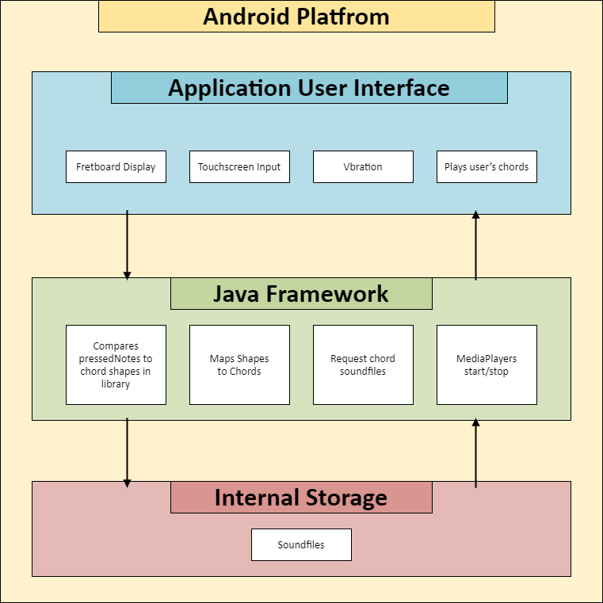
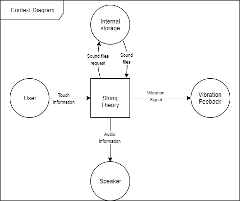
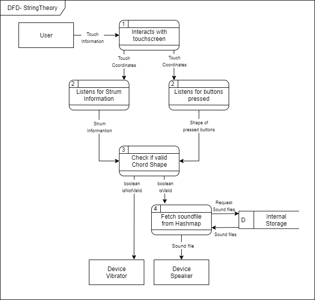
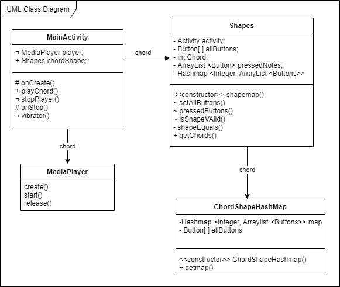
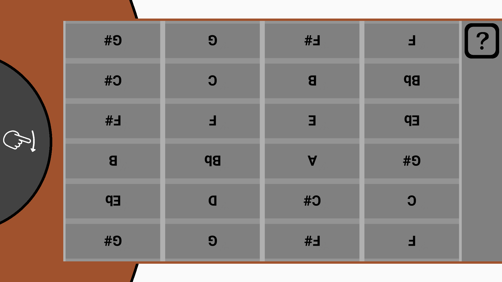
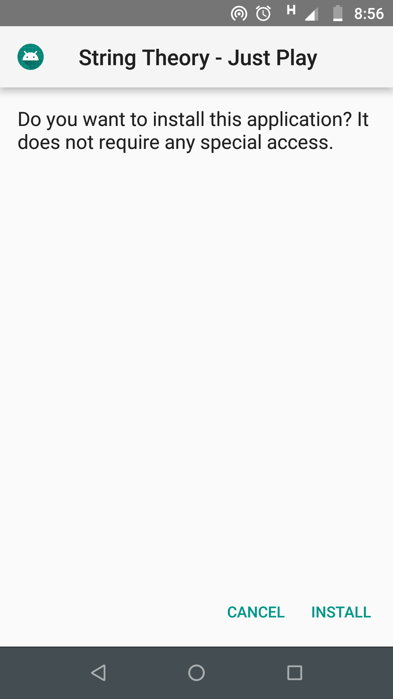
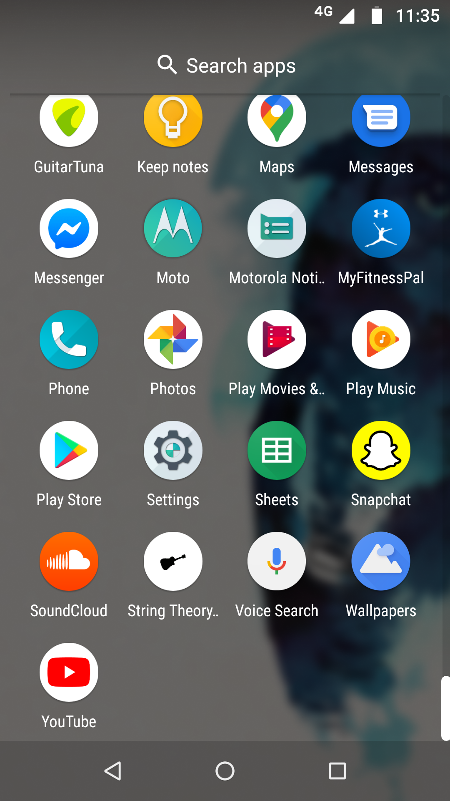

<h1>Technical Specification</h1>

<h2>0. Table of contents</h2>

[Introduction](#Introduction) 
 
[System Architecture](#System_Architecture) 
 
[High-Level Design	](#High-Level_Design) 
 
[Testing](#Testing) 
 
[Problems and Resolutions](#Problems_Resolutions) 
 
[Installation Guide](#Installation_Guide) 

<h2>1. Introduction</h2>

<h4>1.1 Overview</h4>

Our project is called &quot;StringTheory&quot;. StringTheory is an Android application to help users learn and practice guitar chords without a guitar. This is especially useful for those who travel a lot, use public transport, or for beginners who can&#39;t practise on a real guitar for long periods of time without their fingers hurting.

The idea is that the phone&#39;s screen would be transformed to look like a guitar&#39;s fretboard. When the user makes a strumming motion near the base of the phone&#39;s screen, the chord the user is playing will be played. The app has fourteen chords that can be played. These chords are considered easily learnt by beginners but also widely used in most songs.

If a user &quot;strums&quot; the phone without holding down on any chord, then the sound of a guitar playing all it&#39;s strings &quot;open&quot; will be played. If you strum and the chord you have pressed down is incorrect then a gentle vibration will happen. This is to give users some tactile feedback while they are practising playing chords.

<h4>1.2 Glossary</h4>

<h5>Fretboard - </h5>Also called the neck or fingerboard of a guitar. A long thin wooden part of a guitar divided up by frets where the player pushes the strings to make notes.

<h5>Midi files - </h5>Musical Instrument Digital Interface – A language that represents sound files. Designed to standardize communication between computers and electronic musical instruments.

<h5>Multi-touch - </h5>A technology allowing a touchscreen to detect and track two or more points of contact (usually the user&#39;s fingers) at once.

<h5>Chord- </h5>A group of (typically three or more) notes sounded together to make a new sound

<h5>Chord Shape - </h5>The layout of notes being pressed when a user makes a specific chord. To play a C chord the guitarist plays a C chord shape.

<h5>Fretting - </h5>When a guitar player pushes on a string over a particular fret to select a note, also called fingering.

<h5>Open String - </h5>When you play a string on the guitar without fretting a note, then you are said to be playing an open string.

<h2>2. System Architecture</h4>

<h4>2.1 Android Framework</h4>

StringTheory is built using the android platform architecture known as Android Studio. This means it&#39;s designed to run on the Android operating system. The display sections of the program are built using XML and the logic of the program is implemented using Java.

<h4>2.2 Application User Interface</h4>

The application and the user will communicate through the device&#39;s touchscreen display, speakers, and vibration motor. In this layer of the system&#39;s architecture, the user will touch the screen to select the correct buttons to form a chord and strum the &quot;guitar&quot;. This touch information will be sent to the next layer to determine if the chord was correctly pressed. These chords will be sent back to the application user interface layer when they are played through the phone&#39;s speakers, or in the case of an invalid chord shape, through the phone&#39;s vibration motor.

<h4>2.3 Java Program</h4>

The core functionality of the app is carried out by a java program. This java framework layer inputs information from the touch display and returns feedback to the user in the form of changing the display, playing sounds, and making the phone vibrate.

The program interprets the touch coordinates on the screen&#39;s buttons as if the user is touching a real fretboard. The program checks if the notes the user has selected create a chord that is included in the app. Using a hashmap the program can play the corresponding mp3 file to the chord the user is selecting. If the buttons pressed does not make up an included chord, the program signals the phone&#39;s vibration motor to emit a vibration from the phone.

The touch information on the strumming area must also be registered. The sound of the correct chord is not played until the area is strummed. Android&#39;s multi-touch feature allows the user to select chords and strum at the same time.

<h4>2.4 Internal Storage</h4>

The sound files for each chord are stored on the device&#39;s internal storage. As they are only small media files, this does not require much storage. The program requests the necessary chords to be played using the hashmap. A java class then plays the selected file through the phone&#39;s speakers.

<h2>3. High-Level Design</h2>

<h4>3.1 Context Diagram<h4>

The context diagram shows how the application will communicate with external entities. In our case, the user communicates with the app through a touchscreen. The program also communicates with the device&#39;s speakers by creating audio to play. The sound files that the program needs are stored in the phones internal storage. These are requested by the program when needed. Finally, the program communicates with the user via the speakers by playing audio. Similarly, the program communicates with the user through the device&#39;s vibration motor, by giving the user feedback.

<h4>3.2 Data Flow Diagram</h4>

The data flow diagram for StringTheory shows how the user&#39;s touch input is turned into audio played by the speaker.

First, the user selects which buttons on the device&#39;s touchscreen to press down on. These buttons represent notes. A listener is set up which constantly monitors what buttons the user is pressing down.

When the user &quot;strums&quot; the touchscreen a snapshot of the pressed buttons is captured at that instance. This data is then sent to a method which checks if the pressed button shape matches the shape of a chord in the chord library. If it does match, then a hashmap which stores the location of the sound files for each chord included in the app returns the sound file location for that chord.

If the shape the user has pressed down doesn&#39;t match a chord in the library then the phone&#39;s vibration motor is called. If the shape pressed down does match then the sound file for that chord is sent to the MediaPlayer class. From here the data is sent to the speakers to play the audio.

<h4>.3 UML Class Diagram</h4>

The Java program uses 4 main classes, MainActivity, Shapes, MediaPlayer (an Android framework), and a hashmap which maps shapes to chords.

The MainActivity class runs when the app is started and initialises the layout (the visual interface of the app). This class also creates an instance of the Shapes class, which has an onTouchListener that constantly monitors the chord shape the user is making. The MainActivity class also includes an onClick method playChord(), which is called when the user &quot;strums&quot; the device.

When playChord is called the chord shape the user is making in that instance is saved. The Shapes method compares this shape to the shapes of known chords using the shapesEquals() method.

Known chords are stored in the devices internal storage and their shapes are mapped to the sound file locations through a hashmap. If the chord played is a valid chord, then the MediaPlayer class is initialised from MainActivity. MediaPlayer is released when the chord is finished playing or a new chord is strummed. This is to improve performance.

In hindsight, it would have been better practice to have split MainAcitivity into two classes since the class has two functions. One class would handle initialising the app and the onClick method, and an AudioPlayer class would deal with playing the chords.

Similarly, Shapes should really be divided into two classes, a class to monitor the buttons the user is pressing down and another class Shapes, which has methods to compare shapes.

<h4>4.1 User Testing</h4>

In order to get user feedback to improve the app, we carried out user testing. The methodology of our user testing was to guide the user through a short tutorial on a real guitar, showing them how to play a few chords. The user would then play the same chords using the app. The user would then return to the guitar and see if their abilities improved.

After this practice, the user would fill in a survey using Google Forms. The survey asked the users a number of questions about their experience levels and if they felt the app helped improve their guitar skills. We also asked the users about any possible improvements that could be made with the app.

The full results of the survey can be found in the testing file in the project&#39;s gitlab repository. In general, however, we found that users liked the app, and felt that it worked well as a tool to practice guitar chords. We also gathered some useful feedback:

<h5>Strumming</h5>

Many users had to be told that you had to strum part of the screen in order for notes to play. This was obviously a weakness with the app. To rectify this we added an icon of a hand making a swiping motion.

<h5>Text (note names)</h5>

Some users felt that the interface was difficult to read, particularly because the screen has to be angled away from the user when playing. We experimented with making the text on the buttons upside down. A user suggested this as it means the writing would be the right way up to the player looking down at their phone.

This was an interesting idea but proved to be quite disorienting when implemented.

In the end, we settled on making the lettering bolder and easier to read. A small improvement but one that gave the app&#39;s overall appearance a more robust feel.

<h5>Help with chords</h5>

Users who had less experience with the guitar had a difficult time remembering the chord shapes featured in the tutorial, nevermind the rest of the chords included in the app. These users requested a way to refer back to which buttons to press down while using the app.

To do this, we implemented a chord list info screen. It needed to be convenient for the user to access so they could check the buttons needed for the chord. For this reason, we added a simple help button on the main fretboard screen itself. This page used a scroll view so the user can scroll through the list of all available chords our application has to offer. This Info screen contains the names of the chords along with a corresponding image to allow ease of use.

<h4>4.2 Unit and Manual Testing</h4>

We carried out unit testing and manual testing in order to ensure that the smaller components of our program were working as expected.

We used JUnit to carry out unit tests, although we found it difficult to get good coverage of our software using these tests. The android framework added a lot of complexity to unit testing.

In order to make sure various methods were giving the expected results we created a branch called testing\_refactoring and added statements to log the values of certain variables.

<h4>4.3 Constraint Testing</h4>

We listed some constraints in our functional specification. We tested our application against these constraints to make sure they followed these rules.

It was important that our app ran could run on low end phones. Throughout the development process we were constantly running our app on a range of devices through the Android Studio emulator. At the end of our project we tested it on a series of phones to make sure the performance and user interface worked on each of them. This verified that our application was able to run on many different platforms ranging in processing power.

To ensure our application was lightweight, we scaled down all our images and saved the images at a reduced size. We saved them as PNG files as they hold their quality better than JPG when reducing the size.

To keep the sound feedback quick and responsive, we kept the media files short and cropped at the beginning. This allowed an instant sound to be produced when the user strums their phone. We also implemented a short vibration feature that gives feedback when the user plays the chord wrong.

The constraint that it must not need an internet connection was followed.

<h4>4.4 UI testing - Accessibility</h4>

We tested our app&#39;s UI accessibility to the standards recommended by the Android official documentation.

<h5>Colour Contrast</h5>

The text on the buttons of our app is bigger than 14pt, the colour contrast of the text is required to be 3.0:1. Our button colour contrast was 5.30:1, more than enough.

The text in the info section has a colour contrast ratio of 4.51:1, alsot enough to pass this accessibility standard.

<h5>Touch Object Size</h5>

The documentation specifies that objects that are touched need to be at least 48px across so users can easily touch them. Each of our buttons are comfortably bigger than this standard.

<h5>UI Object Descriptions</h5>

Each UI element should have a description for users who use a screen reader. We implemented this programmatically by looping through the buttons using the button.contentDescription() function.

<h2>5. Problems and Resolution</h2>

<h4>5.1 Creating chords in real time</h4>

The initial plan for our project was to have an app that can create and play a chord in real-time, based on the notes the user is pressing down. This program would work using MIDI files.

In the early stages of the project, we were able to create a java program that could combine notes into chords using the Jmusic library. This program worked well on our windows machines but we were unable to get it to work on Android, even as we both got more familiar with Android development. We had a program that could play MIDI files from an Android app, the issue was with creating and saving these android files on the fly.

Eventually, we decided to pivot to working on our plan B: to make the app&#39;s core functionality based around learning and practising more well-known chords. This approach was much more successful and in ways, it&#39;s even better for learning guitar, since it allows the users to focus more on learning and perfecting their guitar skills rather than just pressing buttons and making sounds.

<h4>5.2 Object Orientated programming</h4>

Due to the change in plan that happened midway through our project, our code ended up being quite messy. In particular, we found that much of our functionality was being handled by only two java classes: MainActivity and Shapes. These classes didn&#39;t follow the single responsibility principle, so our code ended up not being as robust and easy to read as we hoped.

We attempted to refactor the MainActivity and Shapes classes into two classes each. MainActivity would be divided into a class that deals with the layout file, and another to deal with audio-related methods. The shapes class would be divided into one class for ChordShapes, and another ChordShapeListener class to monitor which buttons were being pushed down.

This ended up being too little too late since we didn&#39;t have time to fully debug this newly refactored code and get it working correctly, so we had to revert back to our two main classes. We traded off having a well laid out program for having one that worked as intended before the submission deadline.

Considering design more before and during development rather than just as an afterthought to refactor is a big takeaway we have from this project.

<h4>5.3 Testing Android apps</h4>

We tested our app in several different ways. We did user testing to see how we could improve the user experience. We tested it to the constraints we set in the functional spec, to make sure the app did what it set out to do. We tested the app to the UI accessibility constraints to ensure it could be used by a wide range of people. We did unit tests and manual tests to test the code of our app.

We initially approached testing our code with unit tests. We were able to write some unit tests for our methods that were plain old Java, but we ran into issues testing methods that made extensive use of the Android Framework. We found tests failing even though the method would obviously be working with standard inputs for the actual app. We responded by focusing more on manual tests to make sure methods were working.

In the testing\_refactoring branch we added manual tests where we couldn&#39;t get unit tests to work. These tests were implemented using the Log.d() function and proved to be far more effective at testing if methods were returning the correct values.

<h4>5.4 Responsive User-Interface</h4>

A problem which we encountered early on was a UI problem. We initially planned on creating the fretboard interface the dimensions of a real guitar fretboard, however, this turned out to look quite unappealing on wider phone screens as it created a lot of blank background space.

We then decided to design the User-Interface to be responsive and change size according to the phone dimensions and resolution. This proved challenging as Android devices come in so many different shapes and sizes, and considering our UI is created out of a series of buttons that all need to be equal dimensions.

After many attempts and using many different layouts Android Studio has to offer, we settled with using ConstraintLayout. Using this was brand new and it seems very complicated at first. Using the  &#39;Chain&#39; feature that ConstraintLayout offers achieved the responsive UI we were looking for.

<h2>6.  Installation Guide</h2>

To install string theory you must have an Android device, preferably a phone because a tablet is too big to be used to practice the guitar effectively. Using your Android phone click on the following Google Drive link and download the stringtheory.apk file.

https://drive.google.com/file/d/17LyqEfyJScBMLR3VyFwtCI2coqDryrUK/view?usp=sharing

This file is an Android Package File, and when you download it onto an android device it allows you to install and use the app included in the file.

Select stringtheory.apk and download the file. Once the file is downloaded, click to open on your phone. From here a pop up will ask you if you want to install the application **.** Select &quot;INSTALL&quot; and the app will be installed on your phone.

Once installed select &quot;open&quot; to open the app. The app can be reopened by selecting the StringTheory icon from your app tray.

