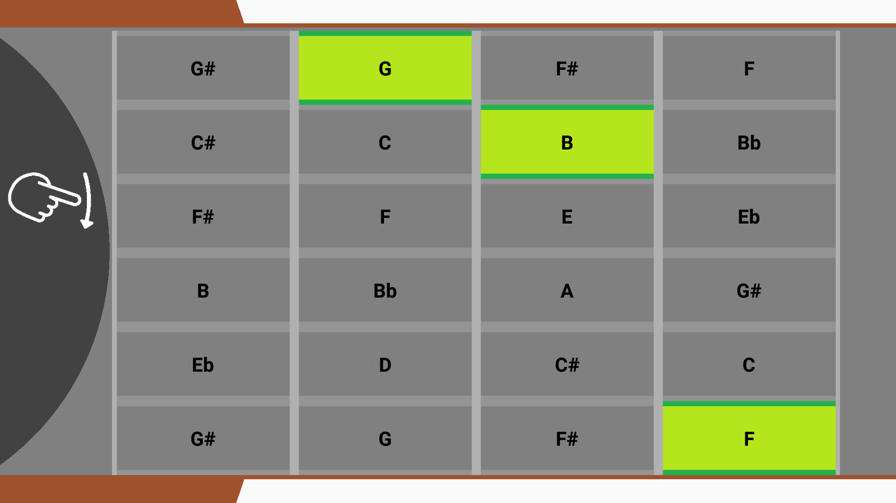

## **StringTheory User Manual**

###

##  How to use the StringTheory Android app.

Paul Treanor - [paul.treanor5@mail.dcu.ie](mailto:paul.treanor5@mail.dcu.ie)

Golin Gorman - [colin.gorman23@mail.dcu.ie](mailto:colin.gorman23@mail.dcu.ie)

##  Table of contents
[Overview](#overview) 
 2. 

[Playing chords](#playing_chords) 
 3. 

[Included chords](#chords) 
 4. 

## Overview

StringTheory is an Android app designed to help users learn and practice guitar chords. The app can be played anywhere, unlike a guitar, and can also be used with headphones. StringTheory also aims to be easier to use than a guitar, since playing it does not hurt your fingers.

##  Playing chords

The app allows the user to learn, play, and practice 14 different chords. These are general chords that are used very frequently and should be enough to allow for playing many songs.

Playing a chord with StringTheory is designed to be similar to playing a chord with a real guitar. The user must press down on the notes of the chord and then strum the instrument. While a user selects notes by pressing down on strings across certain frets on a real guitar, a user selects notes by pressing buttons with StringTheory.

Once a user has selected their chosen chord by pressing down on several notes, they can swipe across the strum area to play the chord. There is a swipe gesture icon over this area to show the user where to &quot;strum&quot;.

##  Included chords

The app allows the player to play 14 chords. The chords included are A, A7, Am, B7, C, C7, D, Dm, E, E7, Em, F, G, and G7.

These chords were selected because they are relatively easy to play for beginners, they are popular chords used in many genres of music, and they lend themselves to be played using a touchscreen. Chords that require one finger to press down more than one string (such as barre chords) cannot be used with a touch screen and therefore we couldn&#39;t include them.

Here are the chords included with the app and the shape (buttons pressed down) required to play each chord:

##  A

##  A7

##  Am

##  B7

## C

##  C7

##  D

##  Dm

##  E

##  E7

##  Em

##  F

##  G

## G7

